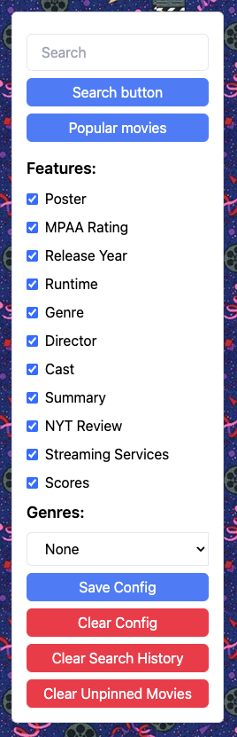

# What to Watch

## Technology Used 

| Technology Used         | Resource URL           | 
| ------------- |:-------------:| 
| HTML    | [https://developer.mozilla.org/en-US/docs/Web/HTML](https://developer.mozilla.org/en-US/docs/Web/HTML) | 
| CSS     | [https://developer.mozilla.org/en-US/docs/Web/CSS](https://developer.mozilla.org/en-US/docs/Web/CSS)      |   
| Git | [https://git-scm.com/](https://git-scm.com/)     |    
| JavaScrpit | [https://www.w3schools.com/js/default.asp](https://www.w3schools.com/js/default.asp) |
| JQuery | [https://api.jquery.com/](https://api.jquery.com/) |
| JQuery UI | [https://jqueryui.com/](https://jqueryui.com/) |
| Slick Carousel | [https://github.com/kenwheeler/slick](https://github.com/kenwheeler/slick) |
| TMDB API | [https://developer.themoviedb.org/docs](https://developer.themoviedb.org/docs) |
| OMDB API | [https://www.omdbapi.com/](https://www.omdbapi.com/) |
| NYT API |  [https://developer.nytimes.com/apis](https://developer.nytimes.com/apis) |
| Streaming Availability API | [https://rapidapi.com/movie-of-the-night-movie-of-the-night-default/api/streaming-availability](https://rapidapi.com/movie-of-the-night-movie-of-the-night-default/api/streaming-availability) |

## Description 


What to Watch is a web application to search for movies and only display the specific result information the user is iterested in. 

The purpose of the project was to allow the user to search for a movie in an input field and have the information that they found relevent shown for the movie that was searched. The previously searched for movies would be stored on the page. The user could check the criteria they were interested in and that would dynamically update the page. The user could save their cirteria configuration until they want to clear it. The user could also find popular movie in general or for a specific genre by selecting the the genre from a drop down. The user could pin movie they wanted to the page so that they would remain persistent even when the page was refreshed. This project used a 3rd party Application User Interface called Slick that created a carousel for the searched movie titles. There were also server side APIs used such as OMDB, TMDB, New York Times and Streaming Availability. These server side APIs were used to get the criteria that is displayed on the page.


We deployed the application on [GitHub](https://github.com/) [Pages](https://pages.github.com/), and it can be found [here](https://jamessahunter.github.io/What-to-watch/).

## Table of Contents (Optional)

If your README is very long, add a table of contents to make it easy for users to find what they need.

* [Installation](#installation)
* [Usage](#usage)
* [Credits](#credits)
* [License](#license)

## User Stories


```javascript
// Any relevant code snippets
```

## User Stories Related to API Calls

For the user story of I want to search for and review side-by-side my desired categories of movie information. Once the movie has been entered into the search bar and the search button has been clicked or the enter key has been pressed. This calls a function that handles the search and ensure something was enterd into the search box and starts the API calls. First there is a call to the OMDB API using the input of movie. This is a general search for a list of 10 movies containing the searched for movie in the title. The results are then checked to see if there are duplicates of the title in which case the user is prompted through a modal to select the year of the movie they would like to search for. If there are no duplicate or after the year is selected another call is made to OMDB this time searching for the specific title and year. The reponse to this call is then checked to see if there is a matching title if so it parse the data and enters it into an obejct. If there is no match the user is informed through a modal. Then the TMDB API is called with the movie and the year and more data is parsed and added to the movie object. Then the NYT API is called which uses the year and the movie to get the appropriate review and adds it to the movie object. Then the streaming availabiltiy API is called which finds out where the movie is streaming and if it is available to rent, buy etc. The information is then appended to the page with the only the information that the user wants to see shown.


For the user story of I want to see popular movies in general or of a specifc genre. First the user can select a genre from the drop down. The user can then click the popular movies button. Once the button is clicked a function gets the id of the genre if there is one. Then a call is made to the TMDB API for popular movies. This then iterates through the array of movie and repeats the process above.


## Description of CSS Framework Tailwind


## Learning Objectives


## Authors / Contact


## Usage 


On page load, the user is presented in the left column with a search input field and **Search** button, a **Popular movies** button, a set of *Features* checkboxes labeled with movie information categories, and a *Genres* drop down. There are four additional buttons at the bottom: **Save Config**, **Clear Config**, **Clear Search History**, and **Clear Unpinned Movies**.



Upon searching for a movie title using the search field, the designated film is presented in a movie card on the right column. The search query is also added to the *Search History* carousel at the top of the right column. Additional searches will continue to populate the right colum with additional movie cards.

Changing checkbox selections will alter the information displayed on the movie cards. For example, unchecking the *Poster* checkbox will remove the movie poster image from the collection of movie cards. The user can save the current checkbox selection to local storage by clicking the **Save Config** button, while the **Clear Config** button will reset the checkboxes to a state of "all on".

If desired, the searh history carousel can be cleared by clicking the **Clear Search History** button.

The user can click on individual movie cards to pin them to the page. A pinned card is designated by a blue border. The set of pinned movie cards is also saved to local storage and will be generated again when the page is reloaded or revisited from the same browser, together with the search history carousel and any saved checkbox configuration.

At any time, the user can click the **Clear Unpinned Movies** button, and any unpinned movie card will be removed. If a previously searched for movie was removed, the user can recover that title by clicking on the query term in the search history carousel.

Finally, clicking on the **Popular movies** button will present the user with movie cards for the current top 20 movies from [TMDB](https://www.themoviedb.org/?language=en-US). If the user first selects a genre from the dropown, the top 20 movies in that genre will be returned.


To add a screenshot, create an `assets/images` folder in your repository and upload your screenshot to it. Then, using the relative filepath, add it to your README using the following syntax:

```md

```


## Credits


List your collaborators, if any, with links to their GitHub profiles.
James Hunter: [github.com/jamessahunter](https://github.com/jamessahunter)
Fiqre Tezare: [github.com/Fiqre-Ab](https://github.com/Fiqre-Ab)
David Wright: [github.com/d-a-v-i-d-w-r-i-g-h-t](https://github.com/d-a-v-i-d-w-r-i-g-h-t)

Created the Slick carousel that contains the previously searched for movies
Ken Wheeler [https://github.com/kenwheeler](https://github.com/kenwheeler)

## License

MIT License

Copyright (c) 2023 James Hunter, David Wright, Fiqre Tezare

Permission is hereby granted, free of charge, to any person obtaining a copy of this software and associated documentation files (the "Software"), to deal in the Software without restriction, including without limitation the rights to use, copy, modify, merge, publish, distribute, sublicense, and/or sell copies of the Software, and to permit persons to whom the Software is furnished to do so, subject to the following conditions:

The above copyright notice and this permission notice shall be included in all copies or substantial portions of the Software.

THE SOFTWARE IS PROVIDED "AS IS", WITHOUT WARRANTY OF ANY KIND, EXPRESS OR IMPLIED, INCLUDING BUT NOT LIMITED TO THE WARRANTIES OF MERCHANTABILITY, FITNESS FOR A PARTICULAR PURPOSE AND NONINFRINGEMENT. IN NO EVENT SHALL THE AUTHORS OR COPYRIGHT HOLDERS BE LIABLE FOR ANY CLAIM, DAMAGES OR OTHER LIABILITY, WHETHER IN AN ACTION OF CONTRACT, TORT OR OTHERWISE, ARISING FROM, OUT OF OR IN CONNECTION WITH THE SOFTWARE OR THE USE OR OTHER DEALINGS IN THE SOFTWARE.

---
